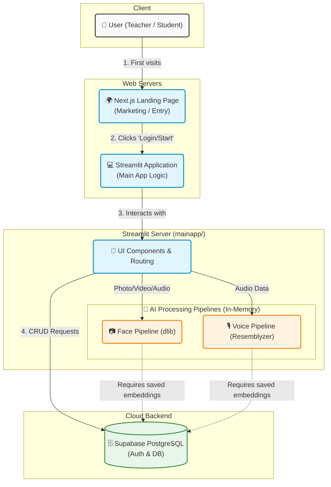

# OmniAttend AI: Architecture & Workflow Detailed Overview

OmniAttend AI is a smart attendance tracking system built on Python that uses Machine Learning (Face and Voice Recognition) to automatically mark students present. It serves two primary roles: **Teachers** and **Students**.

Here is a detailed breakdown of the app's architecture, technologies, and workflow.

---

## 1. Technologies Used

### Frontend & App Framework
* **Streamlit**: The core framework used to build the web application, manage state (`st.session_state`), and render the UI.
* **Custom CSS**: Injected into Streamlit (`base_layout.py` & `app.py`) to give the app a modern, polished, native-app feel (hiding default menus, styling buttons with gradients, etc.).

### Database & Backend
* **Supabase**: Used as the backend Database-as-a-Service (PostgreSQL under the hood). It stores users, embeddings, subjects, and attendance logs. 
* **bcrypt**: Used for securely hashing and verifying teacher passwords before storing them in Supabase.

### Artificial Intelligence & Machine Learning
* **Face Recognition**: 
  * **`dlib`** & **`face_recognition_models`**: Used to detect faces in an image and generate a 128-dimensional embedding (a mathematical representation) for each face.
  * **`scikit-learn` (`SVC`)**: A Support Vector Machine classifier is trained on the fly using the embeddings of all enrolled students. When a class photo is uploaded, the classifier predicts who is in the photo.
* **Voice Recognition**:
  * **`resemblyzer`**: A deep learning library used to generate speaker embeddings from audio bytes.
  * **`librosa`**: Used to process audio files, load them into memory, and split continuous audio into distinct speech segments based on decibel levels (silence removal).
* **Data Processing**: **`numpy`** is heavily used for vector math (calculating cosine similarity and Euclidean distance for facial and voice matches).

---

## 2. System Architecture & Directory Structure

The project is structured modularly within the `mainapp/` directory:

* **`app.py`**: The entry point. It sets up the page configuration, injects global CSS, and handles routing between the `home_screen`, `teacher_screen`, and `student_screen` based on the user's session state.
* **`src/database/`**:
  * `config.py`: Initializes the Supabase client using secrets.
  * `db.py`: Contains all CRUD operations (Create, Read, Update, Delete) for interacting with Supabase (e.g., `create_teacher`, `update_student`, `create_attendance`).
* **`src/pipelines/`**:
  * `face_pipeline.py`: Handles loading Dlib models, extracting face embeddings from images, training the SVM classifier, and predicting attendance from a group photo.
  * `voice_pipeline.py`: Handles loading the Resemblyzer voice encoder, splitting audio into segments, extracting voice embeddings, and matching them against enrolled students using cosine similarity.
* **`src/screens/`**: Contains the main page layouts (`home_screen.py`, `teacher_screen.py`, `student_screen.py`).
* **`src/components/`**: Reusable UI blocks and dialogs (e.g., `dialog_enroll.py`, `dialog_voice_attendance.py`, `subject_card.py`).

---

## 3. Database Schema Workflow

The Supabase database consists of several interconnected tables:
1. **`teachers`**: Stores `teacher_id`, `username`, `name`, and hashed `password`.
2. **`subjects`**: Stores classes created by teachers (`subject_id`, `name`, `section`, `teacher_id`).
3. **`students`**: Stores student profiles, importantly including their biometric data: `face_embedding` and `voice_embedding` (stored as arrays/JSON).
4. **`subject_students`**: A junction table linking students to subjects (Enrollment).
5. **`attendance_logs`**: Records the actual attendance events (`student_id`, `subject_id`, `timestamp`).

---

## 4. Application Workflows

### A. Teacher Workflow
1. **Registration/Login**: Teachers create an account. Passwords are encrypted using `bcrypt`.
2. **Class Management**: The teacher creates a "Subject" (e.g., Math 101). A unique join code is generated.
3. **Taking Attendance**:
   * **Via Face**: The teacher uploads a group photo of the classroom. The `face_pipeline` processes the image, compares it against the trained SVM model of enrolled students, verifies the match score, and logs the present students to the database.
   * **Via Voice**: The teacher uploads an audio file (e.g., students saying "Present" or a class discussion). The `voice_pipeline` splits the audio by silences, generates embeddings for each spoken segment, and matches them to student profiles.
4. **Reporting**: Teachers can view analytics on total classes held and student attendance percentages.

### B. Student Workflow
1. **Onboarding**: A student accesses the app (often via a direct `join-code` link sent by the teacher).
2. **Biometric Setup**: 
   * The student uploads a clear photo of their face. The system extracts the 128-d face embedding and saves it to their profile.
   * The student records or uploads a short voice clip. The system extracts their voice embedding and saves it.
3. **Dashboard**: Students can view the subjects they are enrolled in and track their own attendance records.

---

## 5. How the AI Pipelines Work (Under the Hood)

### Face Recognition Pipeline
1. **Detection**: `dlib.get_frontal_face_detector()` finds the bounding boxes of all faces in the uploaded image.
2. **Landmarks**: A shape predictor finds 68 facial landmarks (eyes, nose, mouth) to align the face.
3. **Embedding**: `dlib.face_recognition_model_v1` converts the aligned face into a 128-dimensional vector (embedding).
4. **Classification**: When taking attendance, the app trains an `SVC` (Support Vector Classifier) on the fly using the database's stored embeddings. It predicts the `student_id` for each face in the group photo.
5. **Verification**: To prevent false positives, it calculates the Euclidean distance between the detected face and the predicted student's stored face. If the distance is `<= 0.6`, the student is marked present.

### Voice Recognition Pipeline
1. **Audio Processing**: `librosa` loads the audio file at a 16kHz sample rate.
2. **Segmentation**: `librosa.effects.split` removes silence (anything below 30 decibels), separating the audio into chunks where people are actively speaking.
3. **Embedding**: The Resemblyzer `VoiceEncoder` converts each spoken segment into a voice embedding.
4. **Matching**: The system compares the segment's embedding against all enrolled students using the **Dot Product (Cosine Similarity)**. If the similarity score is `>= 0.65`, that specific student is identified and marked present.
# Detailed Code Breakdown: `mainapp/` Directory

This guide provides a comprehensive, file-by-file explanation of the exact code logic, UI rendering, and AI integrations taking place within the `mainapp` directory.

---

## 1. The Root Level

### `app.py`
This is the **entry point** of the application. It acts as the traffic controller.
- **Initialization**: It calls `st.set_page_config()` to set the browser tab title and icon.
- **UI Theming**: It injects a large block of custom CSS (`st.markdown(..., unsafe_allow_html=True)`) to hide default Streamlit elements (headers/footers) and style buttons, inputs, and containers to look like a modern native app.
- **Routing**: It checks `st.session_state['login_type']`. Depending on the value, it executes `teacher_screen()`, `student_screen()`, or defaults to `home_screen()`.
- **Query Parameters**: It checks the URL for a `join-code` (e.g., `?join-code=MATH101`). If found, it forces the user into the `student` login type and automatically pops up the `auto_enroll_dialog()`.

### `requirements.txt` & `packages.txt` (if applicable)
- Holds all the dependencies required for the project (like `streamlit`, `supabase`, `dlib-bin`, `resemblyzer`, `scikit-learn`).

---

## 2. `src/screens/` (The Main User Interfaces)

### `home_screen.py`
The simplest screen. It renders a clean landing page with two large buttons: "I am a Teacher" and "I am a Student". Clicking these updates `st.session_state['login_type']` and forces the app to rerun, changing the route.

### `teacher_screen.py`
This is a massive, feature-rich file managing the entire teacher experience.
- **State Management**: It switches between login, registration, and the main dashboard based on state variables like `teacher_login_type`.
- **Authentication**: Contains `login_teacher()` and `register_teacher()`, which validate inputs and call the `db.py` functions to verify hashed passwords.
- **Dashboard Tabs**:
  - **Take Attendance**: Fetches subjects from the database. Allows teachers to upload classroom photos (using `add_photos_dialog`) or trigger Voice Attendance. It loops through the photos, converts them to Numpy arrays, and feeds them to `predict_attendance()`. It then cross-references detected IDs against the students officially enrolled in that subject and saves the logs.
  - **Manage Subjects**: Loops over `get_teacher_subjects()` to render individual `subject_card` components. Buttons here trigger dialogs to share the join code, manage enrolled students, or delete the subject.
  - **Attendance Records (Analytics)**: Queries the database for past logs. Features a complex section that uses `pandas` to group data by timestamp/session. It includes a custom Excel (`xlsxwriter`) generator that creates beautifully formatted "School Registers" showing present/absent data in a grid view with percentage calculations.

### `student_screen.py`
Handles the student journey, prominently featuring AI-first login.
- **FaceID Login**: Uses `st.camera_input` to capture a live photo. It immediately feeds this to `predict_attendance()`. If the AI recognizes the face with high confidence, it logs the student in.
- **Registration**: If not recognized, it prompts the student to enter their name and optionally record a voice phrase via `st.audio_input`. It generates face and voice embeddings and saves the new student profile to Supabase.
- **Dashboard**: Displays enrolled subjects and calculates attendance percentages (attended classes vs total classes held) by iterating through database logs.

---

## 3. `src/pipelines/` (The AI Brain)

### `face_pipeline.py`
- **Model Caching**: Uses `@st.cache_resource` to load `dlib` models into memory once, speeding up subsequent scans.
- **`get_face_embeddings(image_np)`**: Uses the frontal face detector and shape predictor to align a face, then generates a 128-d vector embedding.
- **`get_trained_model()`**: This is dynamically called when attendance is taken. It pulls all student embeddings from the database and trains an `SVC` (Support Vector Classifier) with a `linear` kernel. This allows the AI to differentiate between specific enrolled students.
- **`predict_attendance(image_np)`**: Scans a group photo, gets embeddings for all faces, runs them through the `SVC` to guess the `student_id`, and calculates Euclidean distance. If distance `<= 0.6`, the identity is confirmed.

### `voice_pipeline.py`
- **Model Loading**: Loads Resemblyzer's `VoiceEncoder`.
- **`get_voice_embedding(audio_bytes)`**: Converts a student's initial enrollment audio into a stored embedding vector.
- **`process_bulk_audio(...)`**: Used during class roll calls. It loads the audio using `librosa`, splits it by silence (`librosa.effects.split(top_db=30)`), and generates embeddings for each speaking segment. It then uses dot products (Cosine Similarity) to match segments against the enrolled students' saved embeddings (`threshold=0.65`).

---

## 4. `src/database/` (Data Management)

### `config.py`
Initializes the Supabase client connection by securely pulling `SUPABASE_URL` and `SUPABASE_KEY` from `st.secrets`.

### `db.py`
Contains all backend operations, keeping the UI code clean. 
- **Security**: Includes `hash_pass()` and `check_pass()` using `bcrypt`.
- **Functions**: Detailed functions for fetching subjects, enrolling students (`subject_students` junction table), inserting `attendance_logs`, and performing cascading deletions. It formats the Supabase JSON responses into standard Python dictionaries for the screens to use.

---

## 5. `src/components/` & `src/ui/` (Reusability)

### Dialog Modules (`dialog_*.py`)
Streamlit recently introduced `@st.dialog` for popups. This folder leverages it heavily:
- **`dialog_add_photo.py`**: A popup allowing teachers to upload multiple images or use the camera to build a gallery of classroom photos for analysis.
- **`dialog_voice_attendance.py`**: A popup that captures live audio via `st.audio_input`, triggers the `process_bulk_audio` pipeline, and saves the attendance logs.
- **`dialog_attendance_results.py`**: Shows a summary dataframe of who the AI marked present/absent before finalizing.

### `subject_card.py`
A reusable UI container that takes subject details (name, code, students count) and renders a stylized "Card" with emoji icons and buttons. Used heavily in both Teacher and Student dashboards.

### `base_layout.py` & Headers/Footers
Injects common aesthetic elements (like the gradient backgrounds, the OmniAttend logo `logonew.png`, and styled metric containers) to ensure visual consistency across all pages.
# OmniAttend AI: Real Working System Architecture

Below is a visual representation of how all the moving parts of your application (Landing Page, Streamlit Server, AI Models, and Supabase) connect and interact in real-time.

### How Data Flows Through the System:

1. **The Entry Point:** Users can land on your Next.js site (e.g., hosted on Vercel) which markets the product and provides a button to open the Streamlit Web App.
2. **User Interaction (UI Layer):** 
   - A **Teacher** uses the Streamlit interface to log in, view subjects, and upload classroom photos or audio files.
   - A **Student** uses their webcam directly in the browser.
3. **The AI Layer (In-Memory Processing):**
   - When media is uploaded, it does *not* go to an external AI API. It is processed directly on the Streamlit server's CPU.
   - **Face Inference**: `dlib` extracts a 128-d vector. The server pulls all enrolled student vectors from Supabase, instantly trains a `scikit-learn` Support Vector Classifier (SVC), and predicts the faces.
   - **Voice Inference**: `librosa` slices the audio. `Resemblyzer` converts the voice slices to vectors, and the server calculates the Cosine Similarity against the vectors stored in Supabase.
4. **The Backend Layer (Supabase):**
   - The UI layer communicates with Supabase (via the `supabase-py` client) over HTTPS REST calls. 
   - Supabase handles storing the raw text data, relationships (enrolling students into subjects), and securely storing the heavy vector arrays (embeddings) in its Postgres tables.

---

*This architecture ensures that heavy AI processing happens server-side without relying on paid external APIs (like OpenAI or AWS Rekognition), keeping costs low and data private!*
